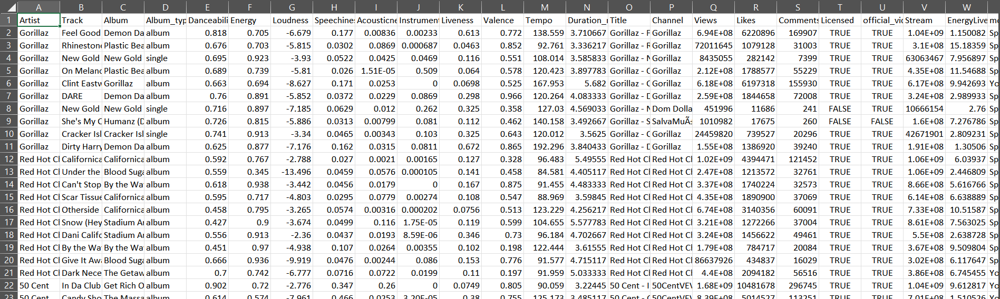
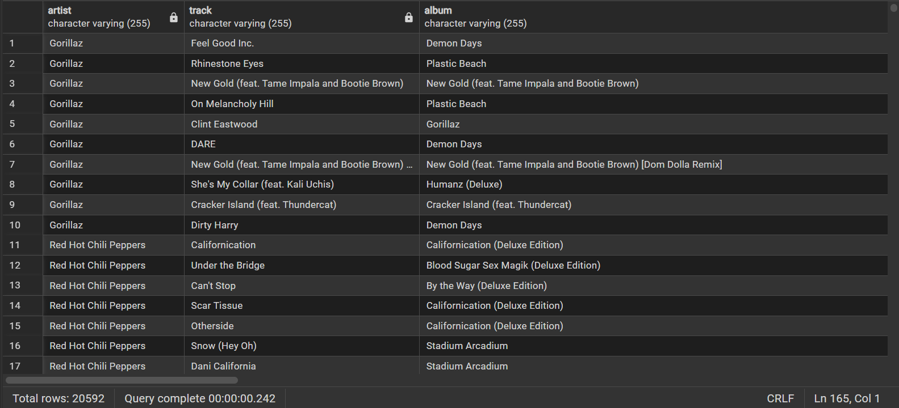
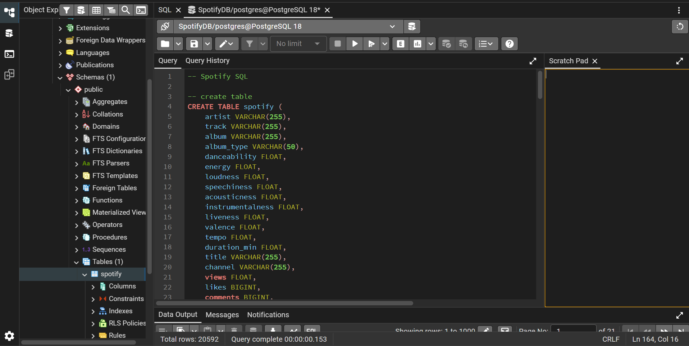

# 🎧 Spotify Analytics – SQL Project

## 📌 Overview

This project simulates real-world data analysis tasks performed on Spotify streaming data. Using PostgreSQL, I explored track performance, user engagement, and audio feature patterns to extract meaningful insights from raw data.

The dataset includes information on tracks, artists, albums, streaming metrics, and audio characteristics such as energy, danceability, and liveness.

---

## 🧱 Database Schema

The dataset contains the following key fields:

* **Track & Artist Info**: artist, track, album, album_type
* **Audio Features**: danceability, energy, liveness, tempo, valence
* **Engagement Metrics**: views, likes, comments, streams
* **Platform Info**: most_played_on (Spotify / YouTube)
* **Flags**: licensed, official_video

---

## 🔍 Key Problems Solved

### 🟢 Data Exploration

* Identified unique artists and album types
* Cleaned invalid records (e.g., zero duration tracks)
* Explored platform distribution and channels

---

### 🟢 Basic Analysis

* Tracks with over **1 billion streams**
* Albums and their respective artists
* Total comments on licensed tracks
* Tracks categorized as singles
* Track count per artist

---

### 🟡 Intermediate Analysis

* Average **danceability per album**
* Top 5 tracks by **energy**
* Engagement metrics for **official videos**
* Total views across albums
* Platform comparison: **Spotify vs YouTube streams**

---

### 🔴 Advanced Analysis

#### 📊 Window Functions

* Ranked top 3 most-viewed tracks per artist using `DENSE_RANK()`

#### 📈 Statistical Insights

* Tracks with **above-average liveness**
* Energy variation within albums (max vs min)

#### ⚖️ Feature Engineering

* Calculated **energy-to-liveness ratio**
* Identified tracks where ratio > 1.2

#### 🔄 Cumulative Metrics

* Running total of likes based on track popularity (views)

---

## 🧠 Key Insights

* High-energy tracks are often among the most viewed, but not always the most liked
* Some tracks perform significantly better on **Spotify vs YouTube**, showing platform preference
* Albums can have large internal variation in audio features (energy spread)
* Tracks with higher energy-to-liveness ratios tend to be more “studio-produced” rather than live
* Cumulative engagement analysis highlights how a small number of tracks dominate total likes

---

## ⚙️ Techniques Used

* Aggregate functions (`SUM`, `AVG`, `COUNT`, `MAX`, `MIN`)
* Conditional aggregation (`CASE WHEN`)
* Window functions (`DENSE_RANK`, `SUM OVER`)
* Subqueries and CTEs (`WITH`)
* Data cleaning and filtering
* Performance-aware grouping and ordering

---

## 🚀 Tools

* PostgreSQL
* SQL

---

## 📎 Summary

This project demonstrates how SQL can be used to transform raw streaming data into actionable insights, similar to real-world analytics workflows used in music streaming platforms like Spotify.

---

